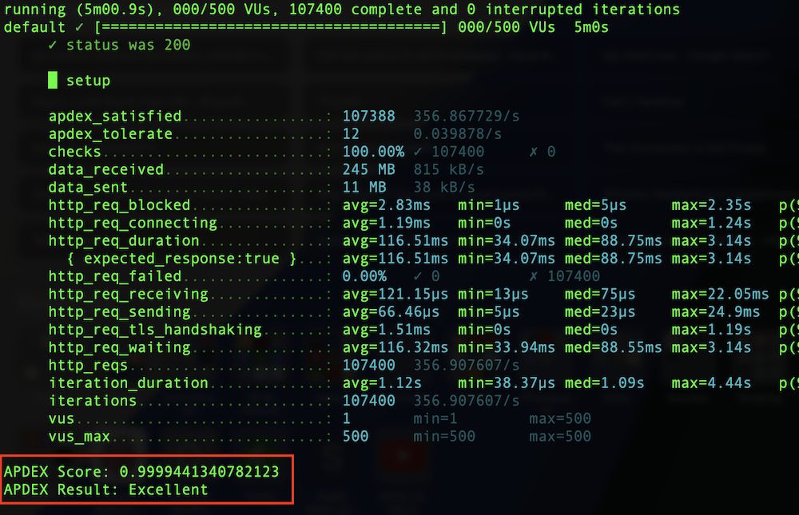

# APDEX Score on K6
This repo share sample script to calculate APDEX Score for your site using K6.


# Sample Script
Sample script can be found in https://github.com/faridiqbal/k6-apdex/blob/main/stages.js.

# Executed
Script can be executed using following command
```
k6 run stages.js
```
